# spec System Diagrams

This file shows the system at multiple resolutions so the boundaries are easier
to hold in your head.

The main distinction to keep straight is:

- `spec` core is the source-of-truth semantic graph and proof pipeline
- passports and exports are derived read surfaces from that core
- semantic-family analysis is a read-side interpretation layer over checked-in
  corpus units
- corpus is an input set for that analysis layer, not the same thing as the
  unit graph itself
- plans are proposed future graph changes, not current source truth

## Resolution 0: One-screen mental model

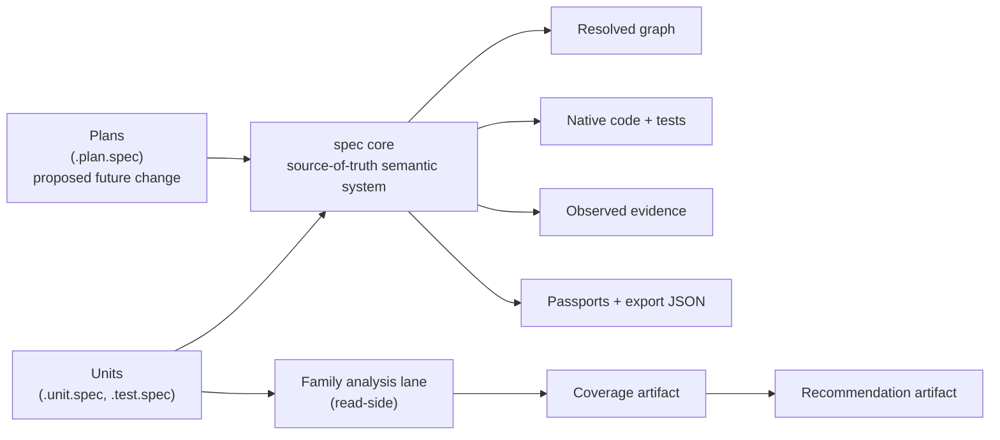

## Resolution 1: Big system layers

This is the cleanest top-level separation.

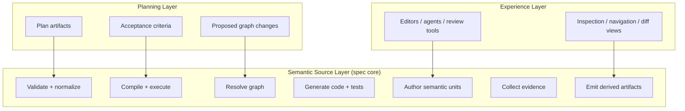

## Resolution 2: The write path, what changes repo truth

This is the path that changes the actual semantic system.

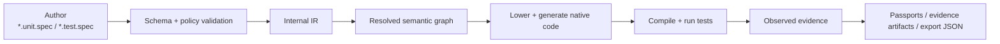

### What each stage means

| Stage | Purpose | Truth type |
|---|---|---|
| `*.unit.spec`, `*.test.spec` | authored semantic source | authored truth |
| validation + IR | make source strict and machine-operable | normalized truth |
| resolved graph | dependency and test-link structure | structural truth |
| compile + test | native behavior check | observed truth |
| passports / export | machine-readable summaries | derived truth |

## Resolution 3: The read surfaces, what is derived vs proposed

This is the boundary people blur most often.

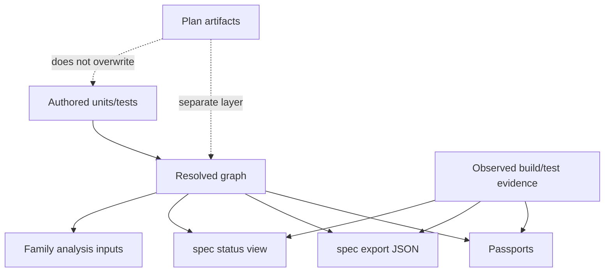

### Truth ownership table

| Surface | Example | What it is | What it is not |
|---|---|---|---|
| authored source | `examples/ecommerce/units/pricing/apply_tax.unit.spec` | source of truth | derived summary |
| observed proof | `.spec.passport.json`, `.test.evidence.json` | recorded execution result | authored intent |
| structural read model | `spec export`, `spec status` | current graph + proof projection | future plan |
| planning surface | `.plan.spec` | intended future graph delta | current implementation truth |
| family analysis | coverage/recommendation artifacts | interpretation of corpus demand | the semantic graph itself |

## Resolution 4: Where semantic families sit

Semantic families are not the whole semantic system.

They are a narrow analysis lane over the Rust `kind:function` subset.

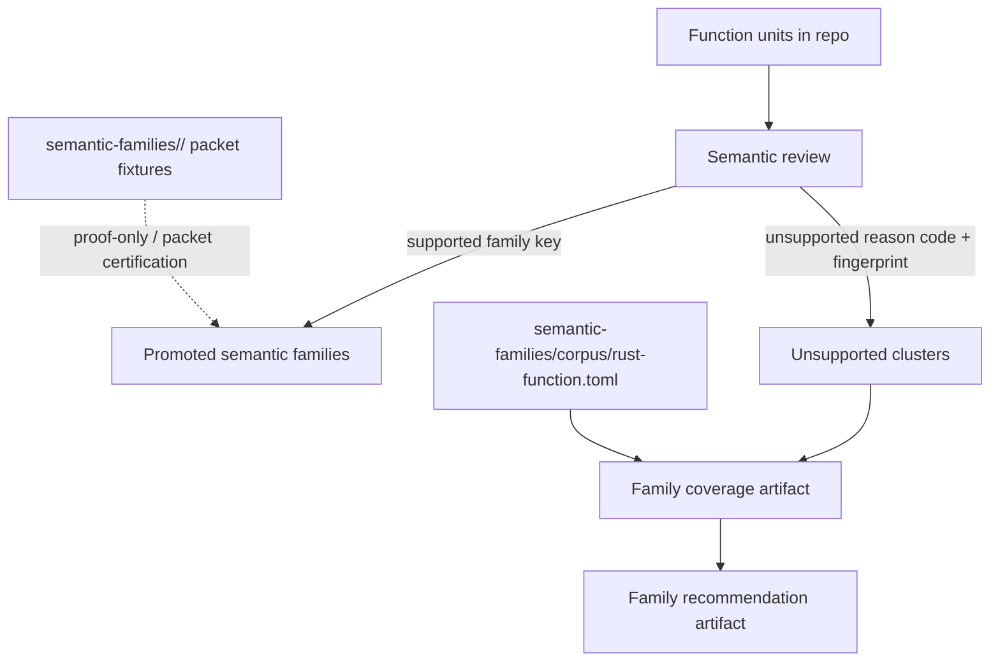

### Important distinction

| Thing | Role |
|---|---|
| semantic review | classifies a function unit against the current supported subset |
| semantic family | a promoted reusable interpretation packet |
| corpus | the checked-in input set used to study demand and route unsupported shapes |
| coverage artifact | what unsupported/supported demand the corpus currently shows |
| recommendation artifact | what next family, if any, looks promotion-worthy |

## Resolution 5: Close-up of the family-analysis lane

This is the current M27.x lane.

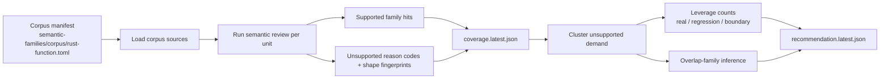

### Current family-analysis decision axes

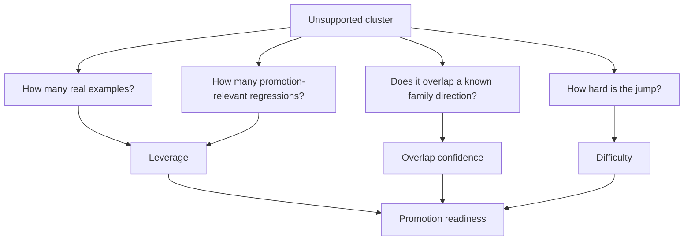

## Resolution 6: The current confusion, `money/round` vs arithmetic

This is the specific distinction behind the recent corpus discussion.

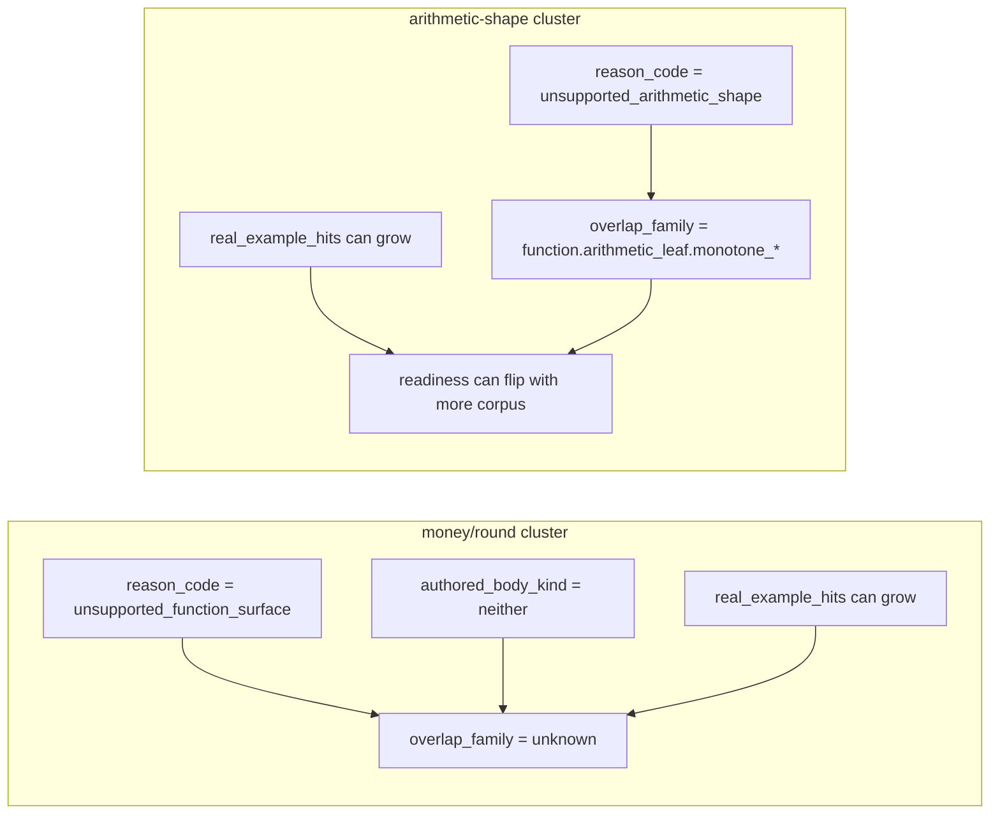

### Why these behave differently

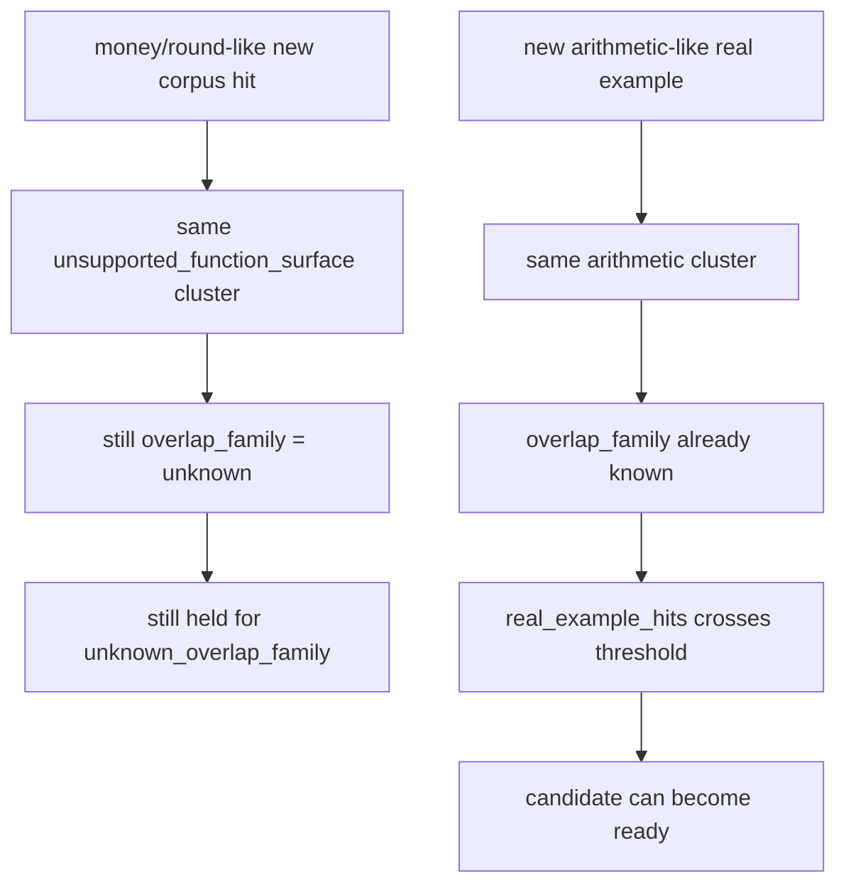

### Plain-English summary

| Cluster | What more corpus changes | What more corpus does not change |
|---|---|---|
| `money/round` unsupported-function-surface | leverage counts | family direction |
| arithmetic-shape | leverage counts | enough to unlock readiness because direction is already known |

That is why “more corpus” can be real progress for arithmetic but mostly just
louder uncertainty for the current `money/round` shape.

## Resolution 7: How passports relate to all of this

Passports are about per-unit proof and machine-readable state. They are not the
same artifact family as corpus recommendation.

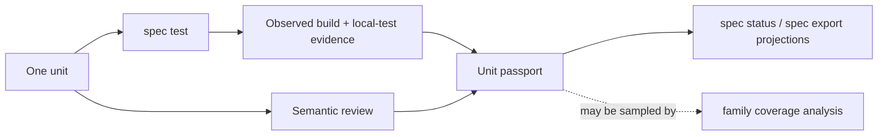

### Passport vs family-analysis comparison

| Surface | Center of gravity | Granularity | Main question |
|---|---|---|---|
| passport | one unit | per-unit | what do we know about this unit right now? |
| molecule evidence | one interaction test | per-test | what cross-unit behavior was observed? |
| export / status | one library or root | graph slice | what is the current structural + proof picture? |
| family coverage | many function units across sources | corpus slice | what supported and unsupported function demand exists? |
| family recommendation | many clusters | next-family candidate | what family, if any, should be promoted next? |

## Resolution 8: End-to-end map

This is the full map with the major axes on one page.

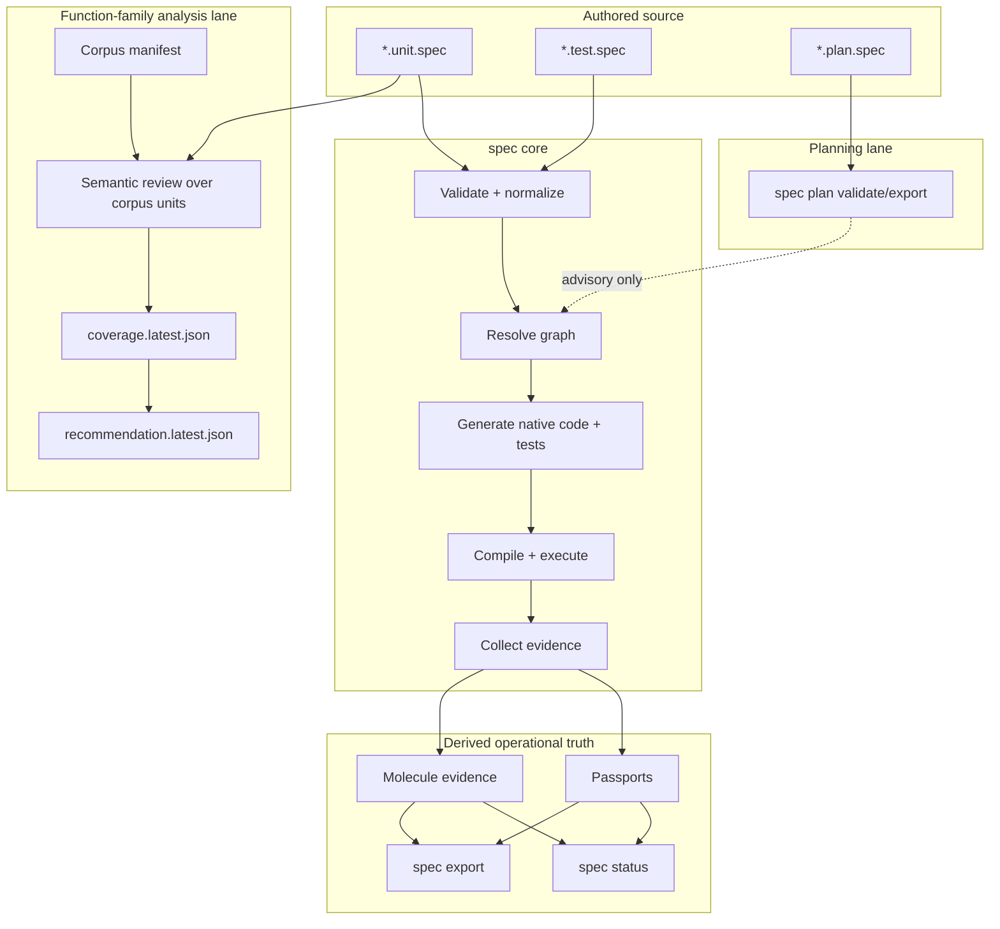

## Reading guide

If you want the shortest useful reading order:

1. Resolution 0
2. Resolution 3
3. Resolution 4
4. Resolution 6

That path gives the core distinction:

- the graph system is the semantic source and proof engine
- passports are derived per-unit proof surfaces
- semantic-family analysis is a narrow read-side interpretation lane
- corpus work changes that lane's inputs
- not every family-analysis blocker is actually fixable by more corpus
